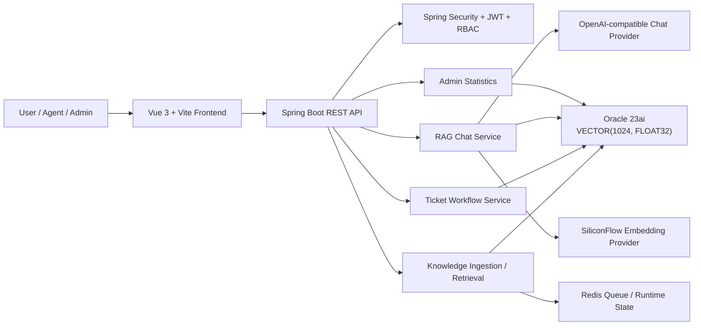

# AI Knowledge Ticket System


An end-to-end AI knowledge-base question answering and ticket collaboration system built with Spring Boot, Oracle 23ai Vector Search, Redis, Vue 3, and an OpenAI-compatible LLM provider.

The project demonstrates a complete support workflow: administrators maintain a knowledge base, users ask AI questions with citations, unresolved questions can be converted into tickets, admins assign tickets with an explainable recommendation, agents process the tickets, users confirm closure, and dashboards track the result.

> Final defense / demo path: [docs/demo/final-defense-runbook.md](docs/demo/final-defense-runbook.md)

## Table of Contents

- [Highlights](#highlights)
- [Feature Matrix](#feature-matrix)
- [Architecture](#architecture)
- [Tech Stack](#tech-stack)
- [Repository Layout](#repository-layout)
- [Quick Start](#quick-start)
- [Demo Accounts](#demo-accounts)
- [Verification](#verification)
- [Documentation Index](#documentation-index)
- [Security Notes](#security-notes)
- [Roadmap](#roadmap)
- [License](#license)

## Highlights

- **RAG over Oracle 23ai vectors**: stores knowledge chunks in `VECTOR(1024, FLOAT32)` and retrieves grounded context for user questions.
- **AI chat with citations**: renders source snippets and supports SSE streaming with an HTTP fallback.
- **AI-to-ticket handoff**: converts an AI session into a traceable ticket when the user still needs manual support.
- **Role-based workflow**: admin, user, and agent roles see different menus and actions through Spring Security + JWT + RBAC.
- **Manual control with smart recommendation**: admin keeps final assignment control while the system recommends the lowest-load active agent.
- **Priority-based SLA visibility**: ticket creation derives `deadlineAt`; list/detail pages show `ON_TRACK`, `DUE_SOON`, `OVERDUE`, and `COMPLETED`.
- **Defense-ready evidence**: smoke scripts, frontend tests, backend tests, build checks, and acceptance evidence are documented.

## Feature Matrix

| Area | Capability | Current Status |
| --- | --- | --- |
| Authentication | JWT login, `/api/auth/me`, route guard, role menus | Implemented |
| RBAC | user, role, permission, menu model | Implemented |
| Knowledge Base | text ingestion, `.txt/.md` upload, parsing state, retrieval test | Implemented |
| Vector Search | Oracle 23ai vector column and similarity retrieval | Implemented |
| RAG Chat | OpenAI-compatible chat, SiliconFlow embeddings, citations, SSE stream | Implemented |
| Ticket Workflow | create, assign, start, resolve, reopen, confirm close, manage close | Implemented |
| Comments | public replies, agent replies, internal notes | Implemented |
| Assignment Recommendation | read-only lowest-workload AGENT recommendation | Implemented |
| SLA | priority-based deadline and derived SLA status | Implemented |
| Admin Dashboard | totals, pending/processing/resolved/closed counts, knowledge and AI metrics | Implemented |
| System Admin | user list, role list, permission visibility, status controls | Implemented |
| Acceptance Evidence | repeatable smoke collector with redacted logs | Implemented |

## Architecture



Core design choices:

- **Workflow state changes are centralized** in `TicketWorkflowService`.
- **Assignment recommendation is read-only** and does not mutate ticket state until an admin uses the existing assignment action.
- **SLA status is derived** from ticket status and `deadlineAt`, avoiding a background scheduler for the current demo scope.
- **Secrets are externalized** through local env files and must never be committed.

## Tech Stack

### Backend

- Java 21
- Spring Boot 3.3.5
- Spring Security
- MyBatis 3.0.3
- Flyway
- Oracle JDBC 23.5
- Redis
- JJWT
- Maven

### Frontend

- Vue 3.5
- Vite 6
- TypeScript 5.7
- Pinia
- Vue Router
- Axios
- Element Plus
- ECharts
- Vitest

### Infrastructure

- Oracle Free 23ai container
- Redis 7 container
- Docker Compose

## Repository Layout

```text
.
├── backend/                 # Spring Boot backend
├── frontend/                # Vue 3 frontend
├── docs/
│   ├── acceptance/          # acceptance checklist
│   ├── demo/                # final demo runbooks and demo corpus
│   ├── evaluation/          # RAG evaluation set and reports
│   ├── spikes/              # phase evidence and technical spikes
│   └── superpowers/         # specs and implementation plans
├── tools/smoke/             # repeatable smoke and evidence scripts
├── docker-compose.yml       # Oracle 23ai + Redis
└── .env.example             # local service env example
```

## Quick Start

### 1. Clone and enter the project

```bash
git clone https://github.com/HelloWhatIsYourName/knowledge-ticket-system.git
cd knowledge-ticket-system
```

If you are continuing the recovered local worktree used during development:

```bash
cd /Users/xianghuaifeng/Documents/毕业设计/.worktrees/recovered-phase31
```

### 2. Start local services

```bash
docker compose up -d
docker compose ps
```

Expected services:

- `ai-ticket-oracle` on port `1521`
- `ai-ticket-redis` on port `6379`

### 3. Configure provider secrets

The application expects chat and embedding provider keys from environment variables. For the local defense environment, keep them outside the repository:

```bash
/private/tmp/ai-ticket-secrets/siliconflow.env
/private/tmp/ai-ticket-secrets/deepseek.env
```

Example shell flow:

```bash
set -a
source /private/tmp/ai-ticket-secrets/siliconflow.env
source /private/tmp/ai-ticket-secrets/deepseek.env
set +a
```

Do not paste API keys into README, screenshots, logs, issues, commits, or pull requests.

### 4. Start the backend

Use the Homebrew OpenJDK 21 path explicitly on this machine:

```bash
cd backend

set -a
source /private/tmp/ai-ticket-secrets/siliconflow.env
source /private/tmp/ai-ticket-secrets/deepseek.env
set +a

JAVA_HOME=/opt/homebrew/opt/openjdk@21/libexec/openjdk.jdk/Contents/Home \
PATH=/opt/homebrew/opt/openjdk@21/libexec/openjdk.jdk/Contents/Home/bin:$PATH \
mvn spring-boot:run
```

Do not rely on:

```bash
/usr/libexec/java_home -v 21
```

On the current development machine it may resolve to Java 17.

Backend reachability check:

```bash
curl -i http://127.0.0.1:8080/api/auth/me
```

Expected unauthenticated response:

```text
HTTP/1.1 401
```

### 5. Start the frontend

```bash
cd frontend
npm install
npm run dev -- --host 127.0.0.1 --port 5175
```

Open:

```text
http://127.0.0.1:5175
```

## Demo Accounts

| Role | Username | Password | Main Routes |
| --- | --- | --- | --- |
| Admin | `admin` | `Admin_123456` | `/app/knowledge`, `/app/tickets/manage`, `/app/admin/dashboard`, `/app/system` |
| User | `user` | `Admin_123456` | `/app/ai/chat`, `/app/tickets/my` |
| Agent | `agent` | `Admin_123456` | `/app/tickets/assigned` |

Some recovered demo databases also include:

| Role | Username | Password | Note |
| --- | --- | --- | --- |
| Second-line agent | `agent2` | `Admin_123456` | May be recommended when it has the lowest active workload |

Assignment recommendation note:

- Follow the assignee shown in the Smart Recommendation (`智能推荐`) panel.
- If a defense script must use only `agent`, manually choose `agent` in the assignment dropdown instead of using the recommendation button.

## Verification

### Backend tests

```bash
cd backend
JAVA_HOME=/opt/homebrew/opt/openjdk@21/libexec/openjdk.jdk/Contents/Home \
PATH=/opt/homebrew/opt/openjdk@21/libexec/openjdk.jdk/Contents/Home/bin:$PATH \
mvn test
```

### Frontend tests and build

```bash
cd frontend
npm run test
npm run build
```

### Acceptance evidence

```bash
cd /Users/xianghuaifeng/Documents/毕业设计/.worktrees/recovered-phase31
FRONTEND_BASE_URL=http://127.0.0.1:5175 \
JAVA_HOME=/opt/homebrew/opt/openjdk@21/libexec/openjdk.jdk/Contents/Home \
PATH=/opt/homebrew/opt/openjdk@21/libexec/openjdk.jdk/Contents/Home/bin:$PATH \
tools/smoke/phase31-acceptance-evidence.sh
```

Expected checks:

```text
Backend smoke                  PASS
Frontend dev smoke             PASS
Frontend tests                 PASS
Frontend build                 PASS
Backend documentation coverage PASS
```

The acceptance script writes sanitized logs and redacts tokens.

## Documentation Index

### Start Here

- [Final defense demo runbook](docs/demo/final-defense-runbook.md)
- [V1 demo runbook](docs/demo/v1-demo-runbook.md)
- [V1 live rehearsal checklist](docs/demo/v1-live-rehearsal-checklist.md)
- [V1 acceptance checklist](docs/acceptance/v1-acceptance-checklist.md)

### Demo and Evaluation

- [Demo corpus guide](docs/demo/v1-demo-corpus.md)
- [Demo corpus JSON](docs/demo/v1-demo-corpus.json)
- [Live rehearsal audit](docs/demo/v1-live-rehearsal-audit.md)
- [RAG evaluation set guide](docs/evaluation/rag-evaluation-set.md)
- [RAG evaluation set JSON](docs/evaluation/rag-evaluation-set.json)
- [RAG live evaluation report](docs/evaluation/rag-live-evaluation-report.md)

### Architecture and Specs

- [Overall system design](docs/superpowers/specs/2026-06-19-ai-knowledge-ticket-system-design.md)
- [V1 project plan](docs/superpowers/specs/2026-06-19-ai-knowledge-ticket-v1-project-plan.md)
- [Auth/RBAC backend design](docs/superpowers/specs/2026-06-19-auth-rbac-backend-design.md)
- [SiliconFlow embedding provider design](docs/superpowers/specs/2026-06-19-siliconflow-embedding-provider-design.md)
- [RAG chat design](docs/superpowers/specs/2026-06-20-phase-4-rag-chat-design.md)
- [Ticket workflow design](docs/superpowers/specs/2026-06-20-phase-5-ticket-workflow-design.md)
- [Public homepage and product shell design](docs/superpowers/specs/2026-06-20-public-homepage-product-shell-design.md)
- [Assignment recommendation and SLA design](docs/superpowers/specs/2026-06-23-phase-39-40-assignment-sla-design.md)

### Implementation Plans

- [Phase 31 acceptance evidence plan](docs/superpowers/plans/2026-06-20-phase-31-acceptance-evidence-implementation-plan.md)
- [Phase 32 recovery stabilization plan](docs/superpowers/plans/2026-06-22-phase-32-recovery-stabilization-implementation-plan.md)
- [Phase 39/40 assignment recommendation and SLA plan](docs/superpowers/plans/2026-06-23-phase-39-40-assignment-sla-implementation-plan.md)
- [Phase 43 final demo stabilization plan](docs/superpowers/plans/2026-06-23-phase-43-final-demo-stabilization-implementation-plan.md)

For the full phase history, see [docs/superpowers/plans](docs/superpowers/plans).

### Technical Spikes and Evidence

- [Oracle vector spike](docs/spikes/oracle-vector-spike.md)
- [Knowledge-base vector retrieval](docs/spikes/knowledge-base-vector-retrieval.md)
- [Phase 4 RAG chat](docs/spikes/phase-4-rag-chat.md)
- [Phase 5 ticket workflow](docs/spikes/phase-5-ticket-workflow.md)
- [Phase 6 admin dashboard](docs/spikes/phase-6-admin-dashboard.md)
- [Phase 7 quality and thesis materials](docs/spikes/phase-7-quality-and-thesis-materials.md)
- [Phase 8 frontend integration](docs/spikes/phase-8-frontend-integration.md)

## Security Notes

- Never commit provider keys, JWTs, `.env` files, or local secret files.
- Keep SiliconFlow and DeepSeek credentials outside the repository.
- Smoke scripts must redact tokens before writing evidence.
- The demo passwords are seeded local accounts for a controlled development/demo environment.
- Rotate credentials before deploying anywhere beyond local defense rehearsal.

## Roadmap

Already implemented:

- AI knowledge-base retrieval and RAG chat
- AI-to-ticket handoff
- full manual ticket workflow
- assignment recommendation
- priority-based SLA visibility
- admin statistics and system administration

Reasonable next extensions:

- background SLA escalation and notification delivery;
- configurable SLA policy table;
- skill-based assignment with agent tags;
- richer ticket analytics and agent workload dashboards;
- multi-department approval workflow;
- production packaging and deployment manifests.

## License

No open-source license has been declared yet. Add a `LICENSE` file before distributing this project as an open-source package.
