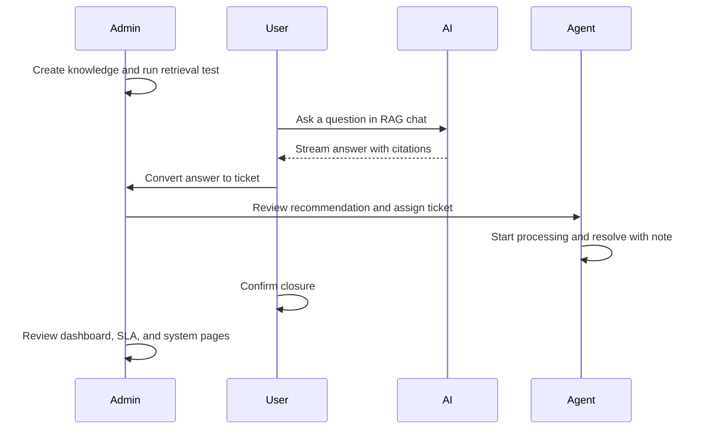
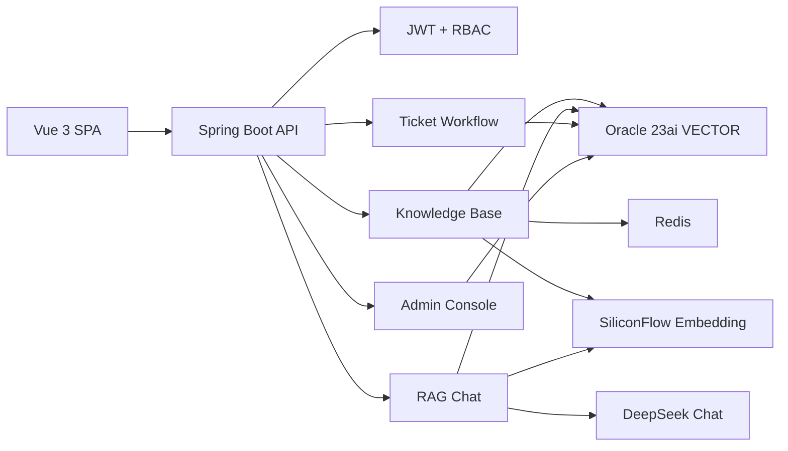

<div align="center">

# AI Knowledge Ticket System

**An AI-native service desk that turns enterprise knowledge into cited answers, traceable tickets, agent work, SLA visibility, and admin insight.**

</div>

<p align="center">
  <a href="#api-configuration"><strong>API Configuration</strong></a>
  ·
  <a href="#run-locally"><strong>Run Locally</strong></a>
  ·
  <a href="#demo-workflow"><strong>Demo Workflow</strong></a>
  ·
  <a href="#documentation"><strong>Docs</strong></a>
  ·
  <a href="#license"><strong>MIT</strong></a>
</p>

<p align="center">
  <a href="#tech-stack"></a>
  <a href="#tech-stack"></a>
  <a href="#tech-stack"></a>
  <a href="#tech-stack"></a>
  <a href="LICENSE"></a>
</p>

---

## Why This Exists

Most support systems split knowledge search, AI chat, ticket handling, agent operations, and admin reporting into separate experiences. This project was built as a graduation-design system to prove a tighter workflow:

```text
Knowledge -> Retrieval -> AI answer -> Ticket -> Assignment -> Agent resolution -> User closure -> Admin insight
```

The goal is not a generic chatbot. The goal is a practical enterprise support platform where an AI answer can be cited, escalated, assigned, processed, measured, and reviewed through one auditable flow.

## What You Get

| Capability | What is implemented |
| --- | --- |
| Knowledge base | Create text knowledge, upload `.txt` / `.md`, track parsing state, run retrieval tests |
| RAG chat | Streaming AI answers, cited knowledge references, HTTP fallback when SSE is unavailable |
| Ticket workflow | Convert AI Q&A to tickets, assign, start processing, add notes, resolve, reopen, confirm close |
| Agent operations | Assigned-ticket queue, status actions, internal processing history |
| Admin operations | Dashboard metrics, ticket assignment, knowledge metrics, user / role / permission management |
| Assignment recommendation | Lowest-workload active-agent recommendation, shown before admin confirms assignment |
| SLA visibility | Priority-based deadlines, list chips, detail panel, completed / due-soon / overdue states |
| Acceptance evidence | Repeatable smoke scripts and a final defense runbook |

## API Configuration

Provider credentials are intentionally kept outside the repository. Do not commit real keys, `.env` files, JWT secrets, or local secret files.

For the local defense environment, place credentials in:

```bash
/private/tmp/ai-ticket-secrets/siliconflow.env
/private/tmp/ai-ticket-secrets/deepseek.env
```

Load them before starting the backend:

```bash
set -a
source /private/tmp/ai-ticket-secrets/siliconflow.env
source /private/tmp/ai-ticket-secrets/deepseek.env
set +a
```

### AI Chat

Default provider: DeepSeek.

| Variable | Default | Description |
| --- | --- | --- |
| `AI_CHAT_BASE_URL` | `https://api.deepseek.com` | OpenAI-compatible chat API base URL |
| `AI_CHAT_API_KEY` | empty | Chat provider API key |
| `AI_CHAT_MODEL` | `deepseek-chat` | Chat model name |

### Embedding

Default provider: SiliconFlow.

| Variable | Default | Description |
| --- | --- | --- |
| `AI_EMBEDDING_BASE_URL` | `https://api.siliconflow.cn/v1` | OpenAI-compatible embedding API base URL |
| `AI_EMBEDDING_API_KEY` | empty | Embedding provider API key |
| `AI_EMBEDDING_MODEL` | `Qwen/Qwen3-Embedding-8B` | Embedding model name |
| `AI_EMBEDDING_DIMENSIONS` | `1024` | Embedding dimension used by Oracle vector storage |

### Local Services

| Variable | Default | Description |
| --- | --- | --- |
| `APP_DATASOURCE_URL` | `jdbc:oracle:thin:@localhost:1521/FREEPDB1` | Oracle connection URL |
| `APP_DATASOURCE_USERNAME` | `AI_TICKET` | Oracle application user |
| `APP_DATASOURCE_PASSWORD` | `ai_ticket_pwd` | Local Oracle application password |
| `APP_REDIS_HOST` | `localhost` | Redis host |
| `APP_REDIS_PORT` | `6379` | Redis port |
| `APP_JWT_SECRET` | `dev-only-change-me-to-a-long-random-secret` | Local-only JWT signing secret |

## Run Locally

### Prerequisites

- Docker and Docker Compose
- Java 21
- Maven
- Node.js and npm

On the current macOS environment, use this Java 21 path:

```bash
/opt/homebrew/opt/openjdk@21/libexec/openjdk.jdk/Contents/Home
```

Do not rely on `/usr/libexec/java_home -v 21`; on this machine it may resolve to Java 17.

### 1. Start Oracle and Redis

```bash
docker compose up -d
docker compose ps
```

Expected local services:

| Service | Address |
| --- | --- |
| Oracle 23ai | `localhost:1521` |
| Redis | `localhost:6379` |

### 2. Start the Backend

```bash
cd backend

set -a
source /private/tmp/ai-ticket-secrets/siliconflow.env
source /private/tmp/ai-ticket-secrets/deepseek.env
set +a

JAVA_HOME=/opt/homebrew/opt/openjdk@21/libexec/openjdk.jdk/Contents/Home \
PATH=/opt/homebrew/opt/openjdk@21/libexec/openjdk.jdk/Contents/Home/bin:$PATH \
mvn spring-boot:run
```

Backend health check:

```bash
curl -i http://127.0.0.1:8080/api/auth/me
```

Expected result when unauthenticated:

```text
HTTP/1.1 401
```

### 3. Start the Frontend

```bash
cd frontend
npm install
npm run dev -- --host 127.0.0.1 --port 5175
```

Open:

```text
http://127.0.0.1:5175
```

## Demo Accounts

| Role | Username | Password |
| --- | --- | --- |
| Admin | `admin` | `Admin_123456` |
| User | `user` | `Admin_123456` |
| Agent | `agent` | `Admin_123456` |

Some recovered demo databases may also contain `agent2 / Admin_123456`. The assignment recommendation panel may prefer `agent2` when that account has the lowest active workload.

## Demo Workflow

The final manual test path is intentionally short and end-to-end:



For the exact defense script, use [Final Defense Demo Runbook](docs/demo/final-defense-runbook.md).

## Architecture



Design choices:

- Ticket transitions are centralized in `TicketWorkflowService`.
- Assignment recommendation is read-only until the admin confirms assignment.
- SLA status is derived from ticket status and deadline, so the demo does not need a scheduler.
- AI providers are OpenAI-compatible and configured through environment variables.

## Verification

Backend tests:

```bash
cd backend
JAVA_HOME=/opt/homebrew/opt/openjdk@21/libexec/openjdk.jdk/Contents/Home \
PATH=/opt/homebrew/opt/openjdk@21/libexec/openjdk.jdk/Contents/Home/bin:$PATH \
mvn test
```

Frontend tests and build:

```bash
cd frontend
npm run test
npm run build
```

Acceptance evidence:

```bash
FRONTEND_BASE_URL=http://127.0.0.1:5175 \
JAVA_HOME=/opt/homebrew/opt/openjdk@21/libexec/openjdk.jdk/Contents/Home \
PATH=/opt/homebrew/opt/openjdk@21/libexec/openjdk.jdk/Contents/Home/bin:$PATH \
tools/smoke/phase31-acceptance-evidence.sh
```

Expected evidence summary:

```text
Backend smoke                  PASS
Frontend dev smoke             PASS
Frontend tests                 PASS
Frontend build                 PASS
Backend documentation coverage PASS
```

## Tech Stack

| Layer | Stack |
| --- | --- |
| Backend | Java 21, Spring Boot 3.3, Spring Security, MyBatis, Flyway, Maven |
| Frontend | Vue 3, Vite, TypeScript, Pinia, Vue Router, Axios, Element Plus, ECharts |
| Data | Oracle 23ai, Redis |
| AI | DeepSeek Chat, SiliconFlow Embedding |
| Verification | JUnit, AssertJ, Vitest, smoke scripts |

## Repository Layout

```text
.
├── backend/              # Spring Boot API, RBAC, RAG, tickets, admin modules
├── frontend/             # Vue 3 SPA and route-level views
├── docs/                 # demo, acceptance, evaluation, design, and plans
├── tools/smoke/          # repeatable smoke and acceptance evidence scripts
├── docker-compose.yml    # Oracle 23ai and Redis for local development
├── .env.example          # non-secret local environment template
└── LICENSE               # MIT license
```

## Documentation

Only the documents needed for review, defense, or continued development are listed here.

| Document | Purpose |
| --- | --- |
| [Final defense demo runbook](docs/demo/final-defense-runbook.md) | Manual demo path and acceptance walkthrough |
| [Final thesis and defense materials](docs/thesis/README.md) | Thesis DOCX and defense PPTX |
| [V1 acceptance checklist](docs/acceptance/v1-acceptance-checklist.md) | Acceptance criteria and evidence mapping |
| [Original project plan](docs/superpowers/specs/2026-06-19-ai-knowledge-ticket-v1-project-plan.md) | Initial graduation-design goals and scope |
| [System design](docs/superpowers/specs/2026-06-19-ai-knowledge-ticket-system-design.md) | Architecture, domains, and workflow design |
| [Assignment recommendation and SLA design](docs/superpowers/specs/2026-06-23-phase-39-40-assignment-sla-design.md) | Extensibility design for Phase 39/40 |
| [RAG evaluation set](docs/evaluation/rag-evaluation-set.md) | Retrieval and answer-quality evaluation corpus |

## Security

- Keep DeepSeek, SiliconFlow, JWT, database, and local secret values out of Git.
- Use local secret files or environment variables for provider credentials.
- Smoke and acceptance scripts redact tokens before writing evidence.
- Demo passwords are for local development and defense rehearsal only.
- Rotate credentials before any non-local deployment.

## License

This project is released under the [MIT License](LICENSE).
